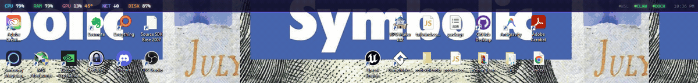
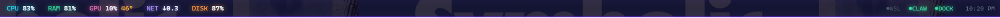

# ClawMonitor

A frameless, **always-on-top neon system monitor** for Windows — a slim synthwave bar pinned to the top of your screen with CPU / RAM / GPU / disk / network at a glance, and a hover-to-expand panel with per-core load, top processes, temperatures, and **your dev stack's health** (Docker, WSL, Ollama, and more).



It's **click-through** (your apps stay fully usable underneath) and **reserves screen space** like the taskbar, so maximized windows sit below it instead of being covered.

---

## Features

- **Glanceable bar** — CPU · RAM · GPU (+temp) · network · disk, always on top.
- **Hover panel** — per-core CPU bars, top processes, GPU details (VRAM/power/fan), RAM, and a "Your Stack" tile.
- **Dev-stack monitoring** — live up/down status for an HTTP service (e.g. a local gateway on `:18789`), **WSL** (vmmem usage), **Docker**, and **Ollama** (`:11434`). 🟢/⚪ dots, no other monitor does this.
- **CPU temperature** via [LibreHardwareMonitor](https://github.com/LibreHardwareMonitor/LibreHardwareMonitor) (optional — see below). GPU temp works out of the box via `nvidia-smi`.
- **Click-through** — never blocks clicks to the apps beneath it; the panel opens on hover (cursor-tracked).
- **Reserves screen space** — registers as a Windows AppBar so maximized apps start below the bar (self-healing across restarts).
- **Pulsing red alerts** when a metric redlines (CPU/GPU > 90%, temp > 80°C, low disk, or your service goes down).
- **Synthwave styling** with selectable palettes (classic / Tron ice / toxic green).
- **Auto-start at login**, single-instance, ~light footprint.



---

## Download & install

1. Grab the latest **`ClawMonitor Setup x.y.z.exe`** from the [Releases](../../releases) page.
2. Run it. Because the app isn't code-signed yet, Windows SmartScreen may say *"Windows protected your PC"* — click **More info → Run anyway**. (It's an unsigned indie build, not malware; the full source is in this repo.)
3. ClawMonitor installs, adds a Start-Menu shortcut, and starts at login.

**Requirements:** Windows 10/11 (x64). NVIDIA GPU recommended for GPU stats (uses `nvidia-smi`).

---

## CPU temperature (optional)

Windows doesn't expose CPU temperature to normal apps, so ClawMonitor reads it from **LibreHardwareMonitor**:

1. Install [LibreHardwareMonitor](https://github.com/LibreHardwareMonitor/LibreHardwareMonitor/releases) and run it (it loads a signed **PawnIO** sensor driver — approve the prompt).
2. In LHM: **Options → Remote Web Server → Run** (default port **8085**).

ClawMonitor reads `http://localhost:8085/data.json` and shows your CPU package temp. If LHM isn't running, the CPU-temp field simply hides — everything else works fine.

---

## Build from source

```bash
git clone https://github.com/denrod25-del/ClawMonitor.git
cd ClawMonitor
npm install
npm start            # run the app
npm test             # run the test suite (35 tests)
npm run dist         # build a Windows installer into dist/
```

Node.js 18+ and Windows are required.

---

## Configuration

On first run a `config.json` is created in your Electron `userData` folder. Keys:

| Key | Default | Description |
|-----|---------|-------------|
| `palette` | `classic-synthwave` | `classic-synthwave` \| `tron-ice` \| `toxic` |
| `reserveSpace` | `true` | Reserve screen space (AppBar) so apps sit below the bar |
| `clickThrough` | `true` | Pass clicks through to apps underneath |
| `launchAtLogin` | `false` | Start automatically at login |
| `pollFastMs` / `pollSlowMs` | `2000` / `8000` | Poll intervals for load vs. stack-health |
| `thresholds` | — | `cpuPct`, `gpuPct`, `tempC`, `diskFreeGB`, `ramPct` alert limits |
| `modules` | all on | Toggle `sensors`, `stack`, `network`, `disk` |

---

## How it works

- **Main process** runs a modular collector orchestrator (`cpu`, `memory`, `gpu`, `disk`, `network`, `sensors`, `stack`), each timeout-wrapped so one slow/failed reader never blocks the rest. It pushes a merged snapshot to the UI over IPC on a fast (load) and slow (stack-health) tier.
- **Renderer** is a frameless transparent page that draws the bar and panel purely from the latest snapshot.
- Built with **Electron** + [`systeminformation`](https://github.com/sebhildebrandt/systeminformation); the AppBar uses [`koffi`](https://koffi.dev/) to call `SHAppBarMessage`.

---

## License

MIT — see [LICENSE](LICENSE).
